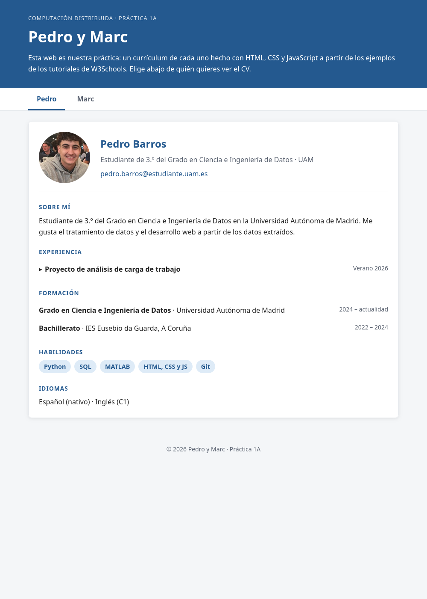

# CV-WEB

Web de currículum hecha desde cero con HTML, CSS y JavaScript puros, sin frameworks ni librerías. Es la Práctica 1A de la asignatura Computación Distribuida (3.º del Grado en Ciencia e Ingeniería de Datos, UAM), hecha en pareja: una sola página con el CV de cada miembro y pestañas para cambiar entre ellos.



## Características

- Pestañas sin recargar la página: JavaScript muestra el CV elegido y oculta el otro (`classList`, `addEventListener`, `preventDefault`).
- Barra de navegación fija (`position: sticky`) que se queda arriba al hacer scroll.
- Experiencia desplegable con `<details>`/`<summary>`: la explicación aparece al pulsar el título, sin una sola línea de JS.
- Etiquetas de habilidades con *tooltip*: al pasar el ratón por encima aparece una explicación hecha solo con CSS (`:hover`).
- Diseño adaptable (*responsive*): Flexbox y una *media query* a 600 px para colocar la cabecera en columna en el móvil y en fila en pantallas grandes.
- Colores centralizados en variables CSS (`:root`), para cambiar el tema desde un solo sitio.
- HTML semántico y accesible: `header`, `nav`, `main`, `section`, `footer`, `aria-label` y textos `alt` en las imágenes.
- Año del pie automático, calculado con `new Date().getFullYear()`.

## Estructura

```
.
├── index.html        # Página con los dos CV
├── css/estilos.css   # Estilos: variables, layout con Flexbox, responsive, tooltips
├── js/script.js      # Lógica de las pestañas y año del pie
├── img/              # Fotos de perfil
└── docs/captura.png  # Captura para este README
```

## Cómo verlo

No hace falta instalar ni compilar nada:

```bash
git clone https://github.com/Code-Cram/CV-WEB.git
cd CV-WEB
xdg-open index.html     # o abrir index.html con cualquier navegador
```

O bien, con un servidor local:

```bash
python -m http.server 8000   # y abrir http://localhost:8000
```

## Tecnologías

HTML5 · CSS3 (Flexbox, variables, media queries) · JavaScript (ES6, DOM)

## Autoría

- Marc Martínez Arias
- Pedro Barros Bobadilla (colaborador)

Hecho a partir de los tutoriales de [W3Schools](https://www.w3schools.com/).
